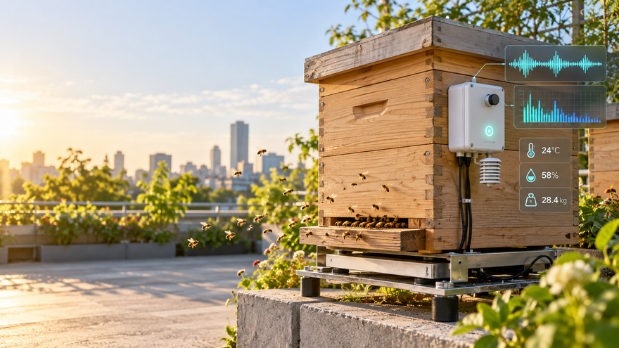
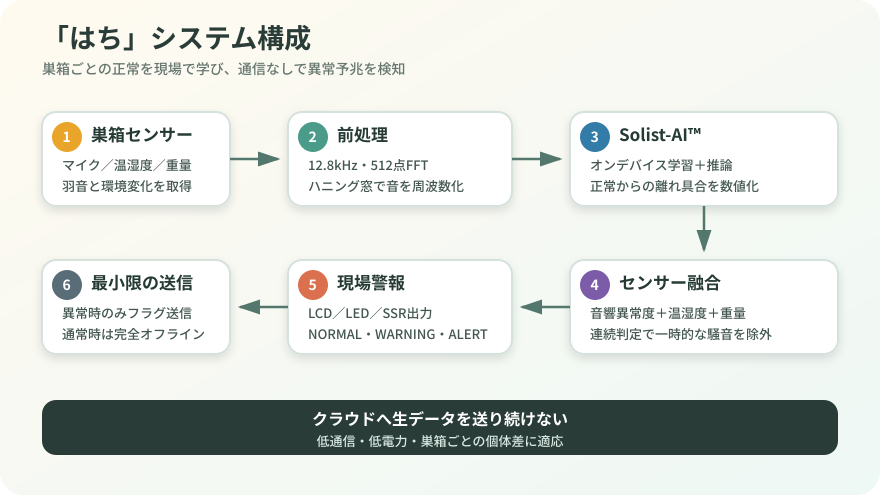

# はち — 通信不要で分蜂の予兆を見守るスマート巣箱



DT-EBML63Q2557（ML63Q2557）で、巣箱内の音響異常と温湿度・重量変化を組み合わせて警報を出すための実装スターターです。

ROHM EDGE HACK CHALLENGE 2026への応募作品として開発しています。

- [ROHM EDGE HACK CHALLENGE 2026 公式情報](https://www.rohm.co.jp/news-detail?news-title=2026-04-22_rehc2026&defaultGroupId=false)
- [DT-EBML63Q2557 製品情報](https://www.datatecno.co.jp/prod_info/solistai_board/)



## できているもの

- `firmware/src/bee_monitor.c` — センサ融合、連続判定、ヒステリシス、警報状態機械（C99）
- `firmware/example/solist_adapter_template.c` — AISignalInferenceへ組み込む差し替えテンプレート
- `tools/bee_monitor.py` — PCで同じ判定を再生・調整するPython実装
- `tools/replay.py` — CSVログ再生CLI
- `tests/` — 正常・警告・異常・復帰の自動テスト
- `docs/IMPLEMENTATION.md` — 配線、AISignalInference設定値、実機統合手順
- `examples/sample.csv` — 動作確認用の模擬データ

## まずPCで確認

Python 3.10以上だけで動きます。

```powershell
python -m unittest discover -s tests -v
python tools/replay.py examples/sample.csv
```

## 判定の考え方

Solist-AIが出す音響異常度を主信号（75%）とし、巣箱ごとの平常値から見た温度上昇・湿度変化・重量低下を補助信号（25%）として融合します。瞬間ノイズで警報しないよう、連続超過と復帰側の別閾値を使います。

この出力は「分蜂の確定診断」ではなく、養蜂家が点検すべき異常予兆です。実地データで閾値を校正してください。

## 実機へ載せる前に必要なもの

配布された `AISignalInference` のソース一式を `vendor/AISignalInference/` に置いてください（このリポジトリには再配布していません）。その後、`firmware/example/solist_adapter_template.c` の `TODO(SOLIST)` 3か所を、配布サンプルの実際の関数名へ接続します。

詳細は [docs/IMPLEMENTATION.md](docs/IMPLEMENTATION.md) を参照してください。
